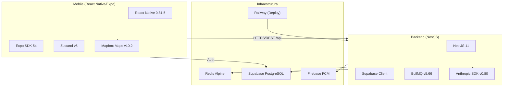
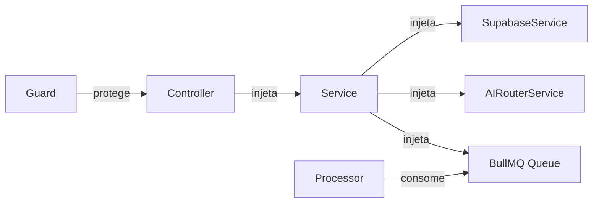
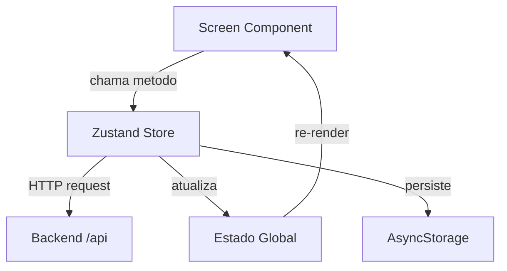
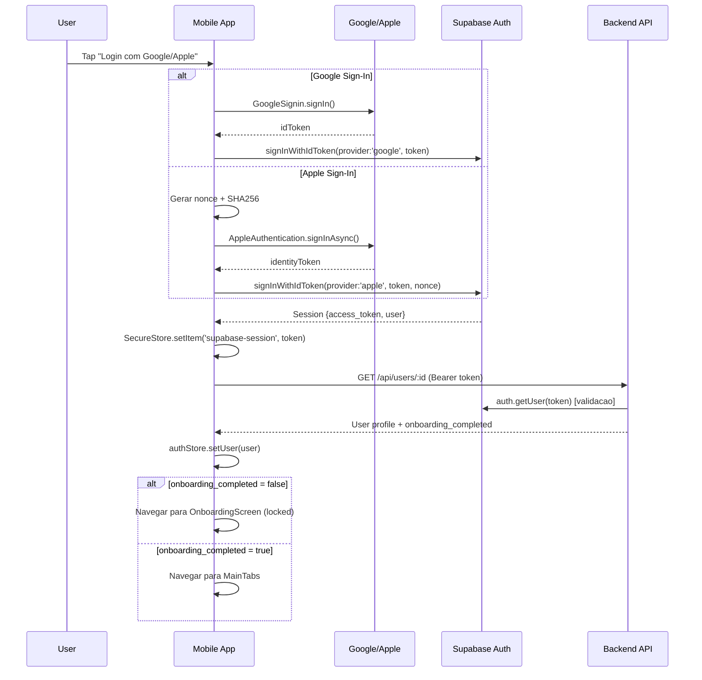
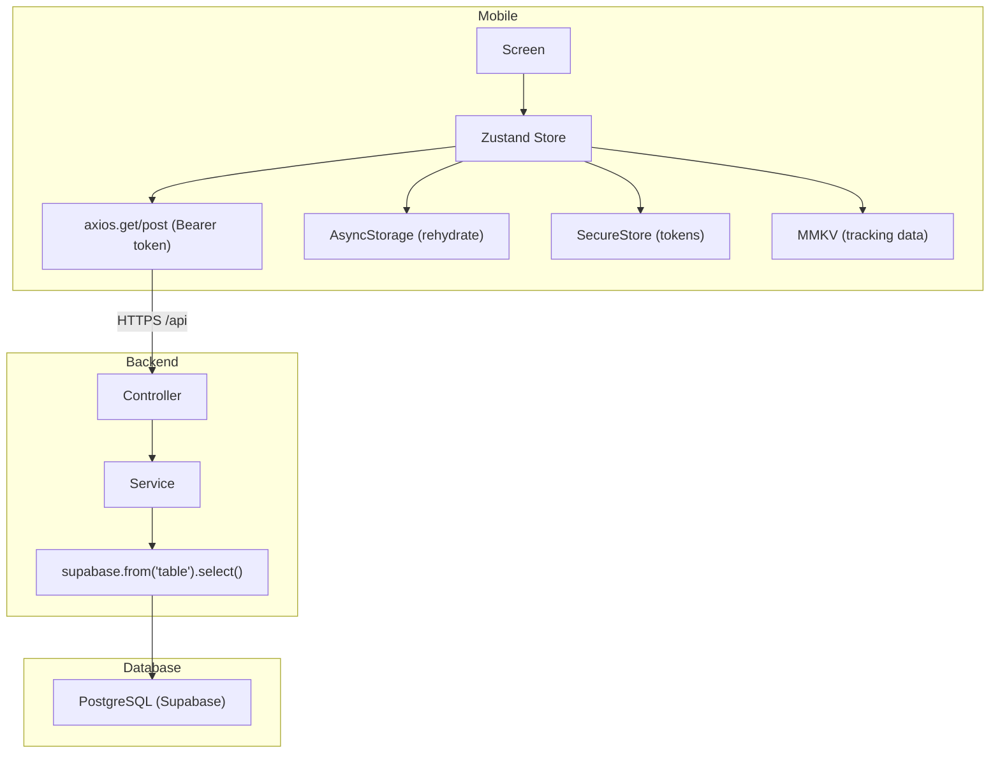
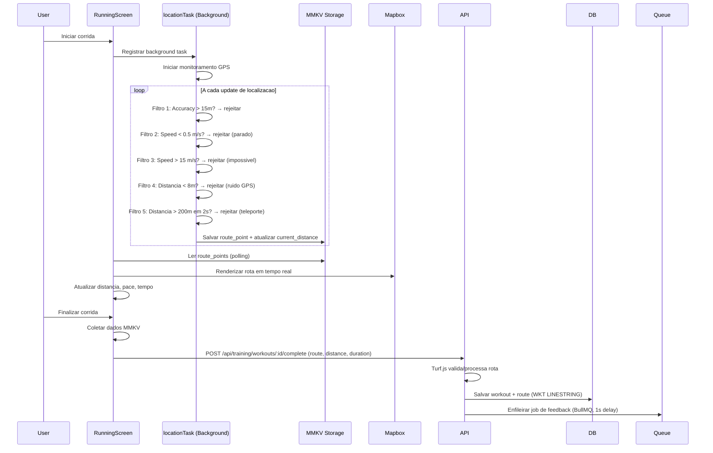
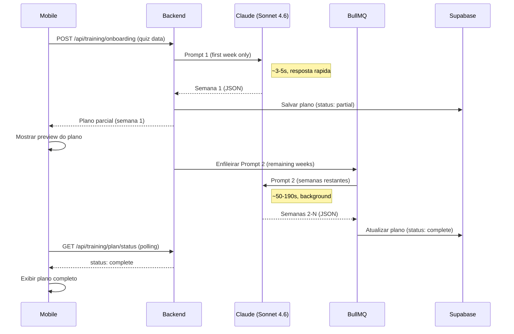
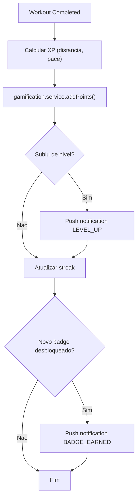
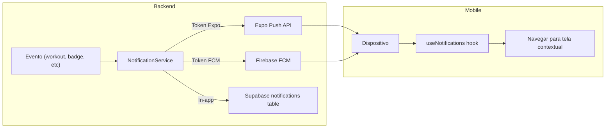

# RunEasy V2 — Arquitetura & Especificacao Tecnica

**Data:** 2026-04-01
**Versao:** 2.0
**Autor:** Auditoria automatizada (Claude Opus 4.6)
**Tipo:** PRD + Architecture Design Document

---

## Indice

1. [Visao Geral do Projeto](#1-visao-geral-do-projeto)
2. [Stack Tecnologica (Deep Dive)](#2-stack-tecnologica-deep-dive)
3. [Arquitetura de Pastas e Padroes](#3-arquitetura-de-pastas-e-padroes)
4. [Fluxos de Dados e Integracoes](#4-fluxos-de-dados-e-integracoes)
5. [Infraestrutura e Configuracoes Nativas](#5-infraestrutura-e-configuracoes-nativas)
6. [Estado Atual e Debito Tecnico](#6-estado-atual-e-debito-tecnico)

---

## 1. Visao Geral do Projeto

### Proposito

RunEasy e uma plataforma de treinamento de corrida alimentada por IA que gera planos personalizados, acompanha treinos em tempo real via GPS e fornece feedback inteligente pos-treino. O diferencial e a combinacao de IA generativa (Anthropic Claude) com gamificacao para manter engajamento.

### Publico-Alvo

- Corredores iniciantes a intermediarios que buscam estrutura de treinamento
- Corredores que querem acompanhar evolucao com dados e IA
- Publico brasileiro (UI em portugues, timezone Sao Paulo UTC-3)

### Proposta de Valor Tecnica

| Aspecto | Valor |
|---------|-------|
| **Planos sob medida** | Claude gera planos com base em biometria, objetivo, ritmo atual e limitacoes |
| **Feedback em tempo real** | GPS tracking com 5 filtros de ruido, calculo de distancia via Haversine |
| **Gamificacao completa** | 15 niveis, XP, badges, streaks, ranking global e por coorte |
| **Readiness check** | Check-in diario de 5 dimensoes (sono, pernas, humor, estresse, motivacao) com veredicto IA |
| **Custo otimizado** | Roteamento multi-modelo (Sonnet 4.6 para planos, Haiku 4.5 para feedback/readiness) com economia de ~47% vs modelo unico |

### Metricas de Negocio (PRD)

- Meta: 3.200 usuarios pagantes, BRL 1,15M ARR ate fim de 2026
- Retencao D30 > 30%, NPS > 60
- Custo IA estimado: ~$0.26/usuario/mes (1K usuarios ativos)

---

## 2. Stack Tecnologica (Deep Dive)

### 2.1 Visao Macro



### 2.2 Frontend — React Native / Expo

| Tecnologia | Versao | Justificativa |
|-----------|--------|---------------|
| **React Native** | 0.81.5 | New Architecture habilitada (Fabric renderer + TurboModules) — performance nativa melhorada |
| **Expo SDK** | 54 | Managed workflow com acesso a modulos nativos via config plugins — acelera desenvolvimento solo |
| **React** | 19.1.0 | Concurrent features, automatic batching — scroll de listas mais fluido |
| **TypeScript** | 5.9.2 | Strict mode desabilitado (produtividade), path aliases (`@/*` → `src/*`) |

**Por que Expo 54?** Suporte a New Architecture, config plugins para Mapbox nativo, EAS Build para distribuicao sem CI/CD proprio.

### 2.3 Backend — NestJS

| Tecnologia | Versao | Justificativa |
|-----------|--------|---------------|
| **NestJS** | 11.x | Framework enterprise com DI, modulos, guards, interceptors — estrutura escalavel |
| **TypeScript** | 5.7.3 | Target ES2021, CommonJS modules, decorators habilitados |
| **Node.js** | >= 18.0 | Requerimento minimo do monorepo |

**TypeScript Config (Backend):**
- `strictNullChecks: false` — modo leniente para produtividade
- `emitDecoratorMetadata: true` — necessario para DI do NestJS
- `resolveJsonModule: true` — importacao de JSONs (Firebase credentials)

### 2.4 Bibliotecas Criticas — Mobile

| Biblioteca | Versao | Papel no Sistema |
|-----------|--------|------------------|
| `@rnmapbox/maps` | 10.2.10 | Renderizacao de mapas e rotas GPS em tempo real. Usa plugin nativo customizado (`plugins/withMapboxAndroid.js`) para injetar token no `strings.xml` antes do boot Android |
| `@supabase/supabase-js` | 2.89.0 | Cliente Supabase para auth (Google/Apple Sign-In) e queries diretas ao PostgreSQL. Storage adapter customizado usa SecureStore |
| `zustand` | 5.0.9 | 8 stores de estado global com persistencia via AsyncStorage. Stores sao donos de todas as chamadas API — screens chamam metodos do store diretamente |
| `expo-apple-authentication` | 8.0.8 | Apple Sign-In nativo com nonce SHA256 para seguranca. Troca token com Supabase via `signInWithIdToken` |
| `@react-native-google-signin/google-signin` | 16.1.2 | Google Sign-In com dois client IDs (Web + Android). Token trocado com Supabase para sessao |
| `expo-location` | 19.0.8 | Permissoes de geolocalizacao (foreground + background). Integra com TaskManager para tracking em segundo plano |
| `expo-task-manager` | 14.0.9 | Background tasks para GPS tracking continuo durante corrida, mesmo com tela bloqueada |
| `react-native-mmkv` | 4.2.0 | Storage ultra-rapido (C++ nativo) para dados de tracking em tempo real — route points, distancia acumulada |
| `haversine` | 1.1.1 | Calculo geodesico preciso de distancia entre coordenadas GPS |
| `expo-notifications` | 0.32.16 | Push notifications com 4 canais Android (default, workout-reminder, achievement, retrospective) |
| `lottie-react-native` | 7.3.4 | Animacoes de alta qualidade para onboarding, badges e telas de sucesso |
| `react-native-reanimated` | 4.1.1 | Animacoes executadas na UI thread (60fps) — transicoes, gestos |
| `@react-navigation/native` | 7.1.25 | Navegacao com deep linking (`runeasy://`), 3-state logic (auth → onboarding → app) |
| `expo-secure-store` | 15.0.8 | Armazenamento criptografado de tokens e credenciais (Keychain iOS / EncryptedSharedPreferences Android) |
| `react-native-view-shot` | 4.0.3 | Captura de screenshots para compartilhamento de resultados de treino |
| `expo-image-picker` | 17.0.10 | Selecao de imagem de perfil do usuario |
| `expo-haptics` | 15.0.8 | Feedback tatil para interacoes (conclusao de treino, badges) |

### 2.5 Bibliotecas Criticas — Backend

| Biblioteca | Versao | Papel no Sistema |
|-----------|--------|------------------|
| `@anthropic-ai/sdk` | 0.80.0 | Integracao direta com Claude. Roteamento multi-modelo via `AIRouterService` (Sonnet 4.6 para planos, Haiku 4.5 para feedback/readiness) |
| `@supabase/supabase-js` | 2.47.0 | Acesso ao PostgreSQL via service role key (bypassa RLS). Sem ORM — queries diretas |
| `bullmq` | 5.66.0 | Fila de jobs async para geracao de feedback pos-treino. Worker pattern com retries automaticos |
| `ioredis` | 5.8.2 | Cliente Redis para BullMQ |
| `firebase-admin` | 13.6.0 | Envio de push notifications via FCM + suporte a Expo Push API |
| `@turf/turf` | 7.3.4 | Analise geoespacial de rotas (distancia, simplificacao de trajeto) |
| `class-validator` | 0.14.1 | Validacao de DTOs com decorators (`@IsString`, `@IsNumber`, etc.) |
| `class-transformer` | 0.5.1 | Transformacao automatica de payloads (whitelist) |
| `@nestjs/schedule` | 4.1.0 | Cron jobs para auto-geracao de treinos e analises de readiness |
| `@nestjs/config` | 3.3.0 | Gestao de variaveis de ambiente com validacao |

---

## 3. Arquitetura de Pastas e Padroes

### 3.1 Estrutura do Monorepo

```
runeasyv2/
├── package.json                    # Scripts unificados (install:all, dev:backend, dev:mobile)
├── docker-compose.yml              # Redis para BullMQ
├── CLAUDE.md                       # Instrucoes para IA assistente
├── runeasy_architecture.md         # Documento de arquitetura detalhado
├── runeasy_dev_planning.md         # Planejamento de sprints
├── runeasy_prd_complete (1).md     # PRD completo
├── RAILWAY_ENV.md                  # Guia de deploy Railway
│
├── backend/                        # NestJS API
│   ├── src/
│   │   ├── main.ts                 # Bootstrap (CORS, ValidationPipe, /api prefix)
│   │   ├── app.module.ts           # Root module (imports globais)
│   │   ├── common/
│   │   │   ├── ai/                 # Infraestrutura IA global
│   │   │   │   ├── ai-router.service.ts    # Roteador multi-modelo
│   │   │   │   ├── ai-usage.service.ts     # Tracking de custo/tokens
│   │   │   │   ├── ai.constants.ts         # Modelos, precos, features
│   │   │   │   └── ai.interfaces.ts        # Tipos compartilhados
│   │   │   └── guards/
│   │   │       └── supabase-auth.guard.ts  # Validacao Bearer token
│   │   ├── database/
│   │   │   ├── supabase.service.ts         # Cliente Supabase (service role)
│   │   │   └── database.module.ts          # Modulo global
│   │   └── modules/
│   │       ├── training/           # Planos IA, workouts, calendario, retrospectiva
│   │       ├── feedback/           # Feedback pos-treino (BullMQ async)
│   │       ├── gamification/       # XP, niveis, badges, streaks, ranking
│   │       ├── readiness/          # Check-in diario + veredicto IA
│   │       ├── notifications/      # Push (Firebase FCM + Expo) + in-app
│   │       ├── stats/              # Metricas semanais, mensais, pace
│   │       ├── users/              # Perfil, LGPD delete
│   │       ├── onboarding/         # Conclusao de onboarding
│   │       └── health/             # Liveness/readiness probes
│   ├── supabase/migrations/        # Migracoes SQL
│   ├── scripts/                    # Stress tests, auditorias
│   └── test/                       # Testes E2E
│
├── mobile/                         # React Native + Expo
│   ├── src/
│   │   ├── screens/               # 19 telas principais
│   │   │   ├── HomeScreen.tsx
│   │   │   ├── CalendarScreen.tsx
│   │   │   ├── RankingScreen.tsx
│   │   │   ├── EvolutionScreen.tsx
│   │   │   ├── SettingsScreen.tsx
│   │   │   ├── LoginScreen.tsx
│   │   │   ├── OnboardingScreen.tsx
│   │   │   ├── quiz/              # 18 telas de quiz onboarding
│   │   │   ├── readiness/         # 3 telas de readiness
│   │   │   └── running/           # RunningScreen (GPS tracking)
│   │   ├── stores/                # 8 Zustand stores
│   │   │   ├── authStore.ts       # Sessao, login/logout
│   │   │   ├── trainingStore.ts   # Plano, workouts, schedule
│   │   │   ├── onboardingStore.ts # Quiz de 18 etapas
│   │   │   ├── gamificationStore.ts # Badges, XP, ranking
│   │   │   ├── readinessStore.ts  # Check-in diario
│   │   │   ├── feedbackStore.ts   # Feedback IA
│   │   │   ├── statsStore.ts      # Estatisticas
│   │   │   └── notificationStore.ts # Notificacoes
│   │   ├── services/
│   │   │   ├── supabase.ts        # Cliente com SecureStore adapter
│   │   │   └── notifications.ts   # FCM/APNs registration
│   │   ├── navigation/
│   │   │   ├── AppNavigator.tsx   # 3-state logic (auth/onboarding/app)
│   │   │   └── navigationRef.ts   # Ref global para navegacao fora de componentes
│   │   ├── hooks/
│   │   │   ├── useNotifications.ts # Listeners de push notification
│   │   │   ├── useTracking.ts      # GPS tracking durante corrida
│   │   │   └── useWorkoutGoals.ts  # Progresso de blocos de treino
│   │   ├── components/            # 16 componentes reutilizaveis
│   │   ├── config/
│   │   │   └── api.config.ts      # Base URL (Railway prod / localhost dev)
│   │   ├── theme/
│   │   │   └── index.ts           # Design system (cores, tipografia, espacamento)
│   │   ├── types/                 # Interfaces TypeScript compartilhadas
│   │   ├── tasks/
│   │   │   └── locationTask.ts    # Background GPS com 5 filtros
│   │   └── utils/
│   │       └── storage.ts         # SecureStore (nativo) / localStorage (web)
│   ├── plugins/
│   │   └── withMapboxAndroid.js   # Config plugin para token Mapbox nativo
│   ├── app.config.js              # Configuracao Expo
│   └── eas.json                   # EAS Build profiles
│
└── telas frontend/                # Mockups UI/UX (exports Figma)
```

### 3.2 Padroes de Design

#### Backend — Module Pattern (NestJS)



**Padrao de cada modulo:**
```
*.module.ts  →  Registra providers, controllers, imports
*.controller.ts  →  Endpoints REST, decorators de auth
*.service.ts  →  Logica de negocio, queries Supabase
*-ai.service.ts  →  Prompts e chamadas Claude (quando aplicavel)
*.processor.ts  →  Worker BullMQ para jobs async
dto/*.dto.ts  →  Validacao de input com class-validator
```

**Autenticacao:** `@UseGuards(SupabaseAuthGuard)` em cada endpoint. User ID via `@Headers('x-user-id')`.

#### Mobile — Store-Driven Architecture



**Padroes identificados:**
- **Stores como donos de API calls** — screens nao fazem fetch diretamente, chamam `store.fetchX()`
- **Hooks customizados** para logica complexa (GPS tracking, notifications, workout goals)
- **Separacao UI/logica** — screens sao composicao de componentes + chamadas a stores
- **Estado global (Zustand) vs local (useState)** — global para dados persistentes, local para UI transiente

#### Persistencia Multi-Camada (Mobile)

| Camada | Tecnologia | Uso |
|--------|-----------|-----|
| **Criptografada** | expo-secure-store | Tokens de auth, credenciais |
| **Rapida (C++)** | react-native-mmkv | Dados de tracking em tempo real (route points) |
| **Persistente** | AsyncStorage | Rehydratacao de stores Zustand |
| **Remota** | Supabase PostgreSQL | Dados do usuario, treinos, badges |

---

## 4. Fluxos de Dados e Integracoes

### 4.1 Autenticacao — Supabase + Apple/Google Sign-In



**Detalhes de seguranca:**
- Apple Sign-In usa nonce criptografico (SHA256) para prevenir replay attacks
- Tokens armazenados em SecureStore (Keychain iOS / EncryptedSharedPreferences Android)
- Backend usa service role key (bypassa RLS) — client nunca tem acesso admin
- Guard valida token Supabase em cada request e opcionalmente verifica consistencia do header `x-user-id`

### 4.2 Persistencia de Dados — Zustand + Supabase + SecureStore



**Fluxo de rehydratacao (cold start):**
1. App abre → Zustand tenta rehydratar stores do AsyncStorage
2. `authStore` verifica se ha sessao valida no SecureStore
3. Se sessao existe → valida com Supabase (`getSession()`)
4. Se valida → fetch user do backend → navega para MainTabs
5. Se invalida → limpa storage → navega para LoginScreen

### 4.3 Geolocalizacao — Mapbox + Background Tracking



**Dados armazenados por ponto GPS:**
```typescript
{
  latitude: number,
  longitude: number,
  altitude: number,
  timestamp: number,
  speed: number,      // m/s
  accuracy: number     // metros
}
```

**Por que MMKV ao inves de AsyncStorage?** MMKV e 30x mais rapido (implementacao C++) — essencial para gravar pontos GPS a cada 1-2 segundos sem bloquear a UI thread.

### 4.4 Geracao de Plano de Treino — Prompt Chaining



**Roteamento de modelos (AIRouterService):**

| Feature | Tier | Modelo | Custo/chamada |
|---------|------|--------|---------------|
| `plan_generation_first` | HIGH_PERFORMANCE | claude-sonnet-4-6 | ~$0.022 |
| `plan_generation_remaining` | HIGH_PERFORMANCE | claude-sonnet-4-6 | ~$0.152 |
| `feedback` | EFFICIENCY | claude-haiku-4-5-20251001 | ~$0.0025 |
| `readiness` | EFFICIENCY | claude-haiku-4-5-20251001 | ~$0.0023 |
| `retrospective` | HIGH_PERFORMANCE | claude-sonnet-4-6 | variavel |

**Fallback automatico:** Se Haiku falha → retry com Sonnet 4.6.

### 4.5 Gamificacao — Sistema de XP/Niveis



**Tabela de niveis (15 niveis):**

| Nivel | Pontos Necessarios |
|-------|-------------------|
| 1 | 0 |
| 2 | 50 |
| 3 | 150 |
| 4 | 300 |
| 5 | 500 |
| 6-15 | Progressao exponencial ate 5200+ |

### 4.6 Notificacoes — Push + In-App



**Canais Android:**
1. `default` — Notificacoes gerais
2. `workout-reminder` — Lembretes de treino
3. `achievement` — Badges e niveis
4. `retrospective` — Analise semanal

**Tipos de notificacao:**
`FEEDBACK_READY`, `WORKOUT_REMINDER`, `STREAK_WARNING`, `BADGE_EARNED`, `LEVEL_UP`, `RETROSPECTIVE_READY`, `RECOVERY_ANALYSIS`

---

## 5. Infraestrutura e Configuracoes Nativas

### 5.1 Configuracao Expo (app.config.js)

**Identificadores:**
- iOS Bundle ID: `com.oytotec.runeasy`
- Android Package: `com.runeasy.app`
- Scheme (deep link): `runeasy://`

**Plugins Nativos Configurados:**

| Plugin | Proposito |
|--------|-----------|
| `expo-apple-authentication` | Apple Sign-In nativo (capability) |
| `./plugins/withMapboxAndroid` | Injeta token Mapbox no `strings.xml` antes do boot nativo |
| `expo-secure-store` | Habilita Keychain/EncryptedSharedPreferences |
| `expo-notifications` | Icon e cor de notificacao customizados |
| `expo-web-browser` | Deep linking para OAuth callbacks |
| `@react-native-google-signin/google-signin` | URL scheme Google OAuth |
| `@rnmapbox/maps` | Download token para SDK nativo Mapbox |

**Permissoes iOS:**

| Permissao | Uso |
|-----------|-----|
| `NSMotionUsageDescription` | Sensores de movimento (pedometro) |
| `NSLocationWhenInUseUsageDescription` | GPS durante uso do app |
| `NSLocationAlwaysAndWhenInUseUsageDescription` | GPS em background (corrida) |
| `NSLocationAlwaysUsageDescription` | Tracking continuo |

**Permissoes Android:**

| Permissao | Uso |
|-----------|-----|
| `ACCESS_FINE_LOCATION` | GPS preciso |
| `ACCESS_COARSE_LOCATION` | GPS aproximado |
| `ACCESS_BACKGROUND_LOCATION` | GPS com tela bloqueada |
| `FOREGROUND_SERVICE` | Servico em primeiro plano (tracking) |
| `FOREGROUND_SERVICE_LOCATION` | Tipo especifico de foreground service |
| `RECEIVE_BOOT_COMPLETED` | Reagendar alarmes apos reboot |
| `VIBRATE` | Haptic feedback |
| `SCHEDULE_EXACT_ALARM` | Alarmes precisos (lembretes) |

### 5.2 Variaveis de Ambiente

**Mobile (prefixo `EXPO_PUBLIC_`):**

| Variavel | Proposito |
|----------|-----------|
| `EXPO_PUBLIC_SUPABASE_URL` | URL do projeto Supabase |
| `EXPO_PUBLIC_SUPABASE_ANON_KEY` | Chave anonima (RLS enforced) |
| `EXPO_PUBLIC_API_URL` | URL do backend Railway |
| `EXPO_PUBLIC_MAPBOX_ACCESS_TOKEN` | Token publico Mapbox |
| `EXPO_PUBLIC_MAPBOX_STYLE_URL` | Estilo customizado do mapa |
| `EXPO_PUBLIC_GOOGLE_CLIENT_ID_WEB` | OAuth Google (web) |
| `EXPO_PUBLIC_GOOGLE_CLIENT_ID_ANDROID` | OAuth Google (Android) |
| `RNMAPBOX_MAPS_DOWNLOAD_TOKEN` | Token secreto para download SDK Mapbox |

**Backend (.env.example):**

| Variavel | Proposito |
|----------|-----------|
| `SUPABASE_URL` | URL do projeto Supabase |
| `SUPABASE_ANON_KEY` | Chave anonima |
| `SUPABASE_SERVICE_ROLE_KEY` | Chave admin (bypassa RLS) |
| `ANTHROPIC_API_KEY` | API key Claude |
| `REDIS_URL` | Conexao Redis (BullMQ) |
| `NODE_ENV` | Ambiente (development/production) |
| `PORT` | Porta do servidor (default: 3000) |
| `FRONTEND_URL` | URL do frontend (CORS) |

**Gestao:**
- Backend: `@nestjs/config` com `ConfigModule.forRoot({ isGlobal: true })`
- Mobile: Expo injeta `EXPO_PUBLIC_*` no bundle via `process.env`
- Producao: Variaveis configuradas no dashboard Railway
- `.env` no `.gitignore` — apenas `.env.example` commitado

### 5.3 Deploy

**Backend → Railway:**
```bash
# Build: instala deps + compila TypeScript
npm run railway:build  # cd backend && npm install && npm run build

# Start: roda o build compilado
npm run railway:start  # cd backend && node dist/main
```
- Escuta em `0.0.0.0:${PORT}` (obrigatorio para containers)
- Auto-deploy via push para branch `main` (GitHub integration)

**Mobile → EAS Build:**
```json
// eas.json
{
  "build": {
    "development": { "developmentClient": true, "distribution": "internal" },
    "preview": { "distribution": "internal" },
    "production": { "autoIncrement": true }
  }
}
```
- CLI version >= 16.28.0
- App version source: remote (EAS gerencia versionamento)

### 5.4 Design System (Theme)

**Paleta de Cores (Dark Theme):**

| Token | Hex | Uso |
|-------|-----|-----|
| `background.dark` | `#0A0A18` | Fundo principal |
| `background.light` | `#0E0E1F` | Fundo secundario |
| `primary.cyan` | `#00D4FF` | Cor primaria (CTAs, destaques) |
| `primary.blue` | `#3B82F6` | Cor primaria alternativa |
| `accent.orange` | `#F59E0B` | Streaks, conquistas |
| `status.success` | `#10B981` | Sucesso, metas atingidas |
| `status.error` | `#EF4444` | Erros, alertas |
| `status.warning` | `#FFC400` | Avisos |
| `card.dark` | `#1A1A2E` | Background de cards |

**Tipografia:**
- Sizes: xs(10), sm(12), md(14), lg(16), xl(18), 2xl(24), 3xl(30), 4xl(36)
- Weights: normal(400), medium(500), semibold(600), bold(700), extrabold(800)

**Espacamento:** xs(4), sm(8), md(12), base(16), lg(20), xl(24), 2xl(32), 3xl(48)

**Sombras:** sm, md, lg, neon (glow effect para elementos interativos)

---

## 6. Estado Atual e Debito Tecnico

### 6.1 Funcionalidades 100% Funcionais

| Feature | Status | Detalhes |
|---------|--------|----------|
| Autenticacao Google + Apple | ✅ Completo | Fluxo completo com SecureStore e Supabase |
| Onboarding (Quiz 18 etapas) | ✅ Completo | Coleta biometria, objetivo, pace, limitacoes |
| Geracao de plano IA (2 etapas) | ✅ Completo | Sonnet 4.6, prompt chaining, background job |
| GPS tracking em tempo real | ✅ Completo | Background task, 5 filtros, MMKV, Mapbox |
| Mapa com rota ao vivo | ✅ Completo | Mapbox com location puck e polyline |
| Feedback pos-treino (IA) | ✅ Completo | Haiku 4.5, BullMQ async, hero message |
| Gamificacao (XP, niveis, badges) | ✅ Completo | 15 niveis, streaks, ranking global/coorte |
| Readiness check diario | ✅ Completo | 5 perguntas, veredicto IA, rotacao de sets |
| Calendario de treinos | ✅ Completo | Visualizacao semanal/mensal com status |
| Push notifications | ✅ Completo | Firebase FCM + Expo Push, 4 canais Android |
| Estatisticas (semanal/mensal/pace) | ✅ Completo | Graficos de evolucao, summary |
| Retrospectiva de plano | ✅ Completo | IA analisa aderencia e sugere ajustes |
| Deploy backend (Railway) | ✅ Completo | Auto-deploy via GitHub |
| Multi-model AI routing | ✅ Completo | Sonnet 4.6 + Haiku 4.5 com fallback |
| AI usage tracking/costing | ✅ Completo | Log de tokens, custo, latencia por chamada |
| LGPD account deletion | ✅ Completo | DELETE /api/users/:userId |

### 6.2 Pontos de Melhoria e Debito Tecnico

#### Prioridade Alta

| Item | Problema | Impacto | Sugestao |
|------|----------|---------|----------|
| **Sem testes unitarios no mobile** | Nenhum test script no `package.json` do mobile | Regressoes nao detectadas | Adicionar Jest + React Native Testing Library |
| **strictNullChecks desabilitado** | Backend e mobile com TypeScript leniente | NPEs em runtime, bugs silenciosos | Habilitar incrementalmente com `// @ts-expect-error` |
| **CORS aberto (`origin: '*'`)** | Backend aceita requests de qualquer origem | Seguranca reduzida em producao | Restringir a dominios conhecidos (Railway URL, localhost) |
| **Sem rate limiting** | `@nestjs/throttler` listado no CLAUDE.md mas nao instalado | Vulneravel a abuso de API (especialmente endpoints IA) | Instalar e configurar ThrottlerModule |
| **Sem Prisma ORM** | Queries Supabase diretas sem type-safety forte | Typos em nomes de colunas nao detectados em compile-time | Considerar adicionar Prisma para queries tipadas (pode coexistir com Supabase client) |

#### Prioridade Media

| Item | Problema | Impacto | Sugestao |
|------|----------|---------|----------|
| **Sem CI/CD automatizado** | Nenhum GitHub Actions configurado | Deploys manuais, sem testes automaticos pre-merge | Adicionar workflow: lint → test → build → deploy |
| **Monorepo sem tooling** | Scripts manuais `cd backend && npm install` | Sem cache de builds, sem paralelismo | Avaliar Turborepo para cache e scripts paralelos |
| **Sem interceptors/filters globais** | CLAUDE.md menciona LoggingInterceptor e HttpExceptionFilter, mas nao encontrados no codigo | Erros nao padronizados, sem logging de latencia | Implementar conforme descrito no CLAUDE.md |
| **Docker apenas para Redis** | Backend roda direto no host em dev | Inconsistencia entre ambientes dev/prod | Adicionar Dockerfile para backend (dev + prod) |
| **Sem Swagger/OpenAPI** | CLAUDE.md menciona setup, mas nao encontrado em `main.ts` | Frontend precisa adivinhar contratos de API | Adicionar `@nestjs/swagger` com decorators nos DTOs |

#### Prioridade Baixa

| Item | Problema | Impacto | Sugestao |
|------|----------|---------|----------|
| **Expo SDK 54 → verificar atualizacao** | Expo 54 pode nao ser a versao mais recente | Possivel perda de bug fixes e features | Verificar changelog e migrar se beneficio claro |
| **FlashList nao utilizado** | Nenhuma referencia a `@shopify/flash-list` no mobile (embora listado em package.json) | Listas longas podem ter janky scroll | Substituir FlatList por FlashList em telas com listas grandes (TrainingHistory, Ranking) |
| **Sem caching HTTP** | Backend nao implementa Redis cache para endpoints frequentes | Queries repetidas ao Supabase | Cache para GET /stats, GET /gamification/stats (5min TTL) |
| **Sharing screen capture** | `react-native-view-shot` instalado mas uso nao verificado | Feature pode estar incompleta | Validar se compartilhamento de resultados esta funcional |

### 6.3 Bibliotecas para Atualizacao

| Biblioteca | Versao Atual | Observacao |
|-----------|-------------|------------|
| `@anthropic-ai/sdk` | 0.80.0 | Verificar se ha versao mais recente com melhorias de streaming |
| `@supabase/supabase-js` | 2.47 (backend) vs 2.89 (mobile) | **Discrepancia de versao** — alinhar para evitar incompatibilidades |
| `bullmq` | 5.66.0 | Estavel, sem urgencia |
| `jest` | 30.0.0 | Major version — verificar compatibilidade com NestJS 11 |
| `expo` | SDK 54 | Verificar se SDK 55+ esta disponivel |

### 6.4 Tabelas do Banco de Dados (Inferidas do Codigo)

| Tabela | Campos Chave | Modulo |
|--------|-------------|--------|
| `users` | id, profile (JSONB), push_token, onboarding_completed | users, auth |
| `user_onboarding` | birth_date, weight, height, pace, limitations, goal | onboarding |
| `training_plans` | plan_json, generation_status, user_id | training |
| `workouts` | scheduled_date, type, distance_km, status, route | training |
| `workout_routes` | route (WKT LINESTRING), raw_data | training |
| `user_levels` | current_level, total_points, streaks, best_paces | gamification |
| `badges` | name, icon, criteria, tier | gamification |
| `user_badges` | badge_id, earned_at, user_id | gamification |
| `notifications` | type, title, description, is_read, metadata | notifications |
| `plan_retrospectives` | plan_id, suggestions, acceptance_status | training |
| `ai_usage_logs` | model_name, tokens, cost_usd, latency_ms, success | common/ai |
| `readiness_verdicts` | score, recommendation, created_at | readiness |

---

## Apendice A — Endpoints da API

### Training
| Metodo | Rota | Descricao |
|--------|------|-----------|
| POST | `/api/training/onboarding` | Criar plano rapido (prompt 1 + background) |
| GET | `/api/training/plan/status` | Polling de status de geracao |
| GET | `/api/training/plan` | Plano ativo do usuario |
| GET | `/api/training/workouts` | Workouts por intervalo de data |
| POST | `/api/training/workouts/:id/complete` | Salvar workout com rota GPS |
| GET | `/api/training/schedule` | Calendario com tipo e status |
| POST | `/api/training/retrospective/generate` | Gerar retrospectiva IA |

### Feedback
| Metodo | Rota | Descricao |
|--------|------|-----------|
| POST | `/api/feedback/generate` | Gerar feedback para workout |
| GET | `/api/feedback/history` | Historico de feedbacks |
| GET | `/api/feedback/:id` | Feedback especifico |
| PUT | `/api/feedback/:id/rate` | Avaliar feedback (1-5) |
| GET | `/api/feedback/latest/activity` | Ultimo feedback (home screen) |

### Gamification
| Metodo | Rota | Descricao |
|--------|------|-----------|
| GET | `/api/gamification/stats` | Nivel, XP, streaks |
| GET | `/api/gamification/badges` | Badges com status de conquista |
| POST | `/api/gamification/points` | Atribuir pontos |
| GET | `/api/ranking` | Leaderboard |

### Notifications
| Metodo | Rota | Descricao |
|--------|------|-----------|
| GET | `/api/notifications` | Notificacoes do usuario |
| GET | `/api/notifications/unread-count` | Contagem de nao lidas |
| PATCH | `/api/notifications/:id/read` | Marcar como lida |
| GET | `/api/notifications/preferences` | Preferencias |
| PATCH | `/api/notifications/preferences` | Atualizar preferencias |
| POST | `/api/notifications/push-token` | Salvar token do dispositivo |

### Readiness
| Metodo | Rota | Descricao |
|--------|------|-----------|
| POST | `/api/readiness/analyze` | Enviar respostas do check-in |
| GET | `/api/readiness/status` | Ultimo veredicto |
| GET | `/api/readiness/questions` | Set de perguntas do dia |

### Stats
| Metodo | Rota | Descricao |
|--------|------|-----------|
| GET | `/api/stats/weekly` | Stats semanais (12 semanas) |
| GET | `/api/stats/monthly` | Stats mensais (6 meses) |
| GET | `/api/stats/pace-progression` | Tendencia de pace |
| GET | `/api/stats/summary` | Resumo geral |

### Users
| Metodo | Rota | Descricao |
|--------|------|-----------|
| GET | `/api/users/:userId` | Perfil do usuario |
| PUT | `/api/users/:userId/profile` | Atualizar perfil |
| DELETE | `/api/users/:userId` | Deletar conta (LGPD) |

### Health
| Metodo | Rota | Descricao |
|--------|------|-----------|
| GET | `/api/health` | Health check |

---

## Apendice B — Diagramas de Arquitetura Alto Nivel

### Visao Geral do Sistema

```
┌─────────────────────────────────────────────────────────────┐
│                      MOBILE (Expo/RN)                       │
│  ┌──────┐ ┌──────┐ ┌──────┐ ┌──────┐ ┌──────┐             │
│  │ Home │ │ Cal  │ │ Rank │ │ Evol │ │ Sett │  ← 5 Tabs   │
│  └──┬───┘ └──┬───┘ └──┬───┘ └──┬───┘ └──┬───┘             │
│     └────────┴────────┴────────┴────────┘                   │
│                        │                                     │
│  ┌─────────────────────┴─────────────────────┐              │
│  │           8 Zustand Stores                 │              │
│  │  auth | training | gamification | stats    │              │
│  │  readiness | feedback | notifications     │              │
│  │  onboarding                                │              │
│  └─────────────────────┬─────────────────────┘              │
│                        │ axios (Bearer token)                │
└────────────────────────┼────────────────────────────────────┘
                         │ HTTPS
┌────────────────────────┼────────────────────────────────────┐
│                  BACKEND (NestJS/Railway)                    │
│                        │                                     │
│  ┌─────────────────────┴─────────────────────┐              │
│  │         SupabaseAuthGuard                  │              │
│  └─────────────────────┬─────────────────────┘              │
│                        │                                     │
│  ┌─────────┐ ┌─────────┐ ┌─────────┐ ┌──────────┐         │
│  │Training │ │Feedback │ │Gamific. │ │Readiness │         │
│  │  + AI   │ │  + AI   │ │         │ │  + AI    │         │
│  └────┬────┘ └────┬────┘ └────┬────┘ └────┬─────┘         │
│       │           │           │            │                 │
│  ┌────┴───────────┴───────────┴────────────┴──────┐        │
│  │              AIRouterService                    │        │
│  │  Sonnet 4.6 (plans) | Haiku 4.5 (feedback)    │        │
│  └────────────────────────────────────────────────┘        │
│                        │                                     │
│  ┌──────────┐  ┌───────┴────┐  ┌──────────┐               │
│  │ BullMQ   │  │ Supabase   │  │ Firebase │               │
│  │ (Redis)  │  │ PostgreSQL │  │ FCM      │               │
│  └──────────┘  └────────────┘  └──────────┘               │
└─────────────────────────────────────────────────────────────┘
```

---

*Documento gerado em 2026-04-01 via auditoria automatizada do repositorio RunEasy V2.*
*Qualquer desenvolvedor novo deve conseguir entender o projeto em 10 minutos com este documento.*
